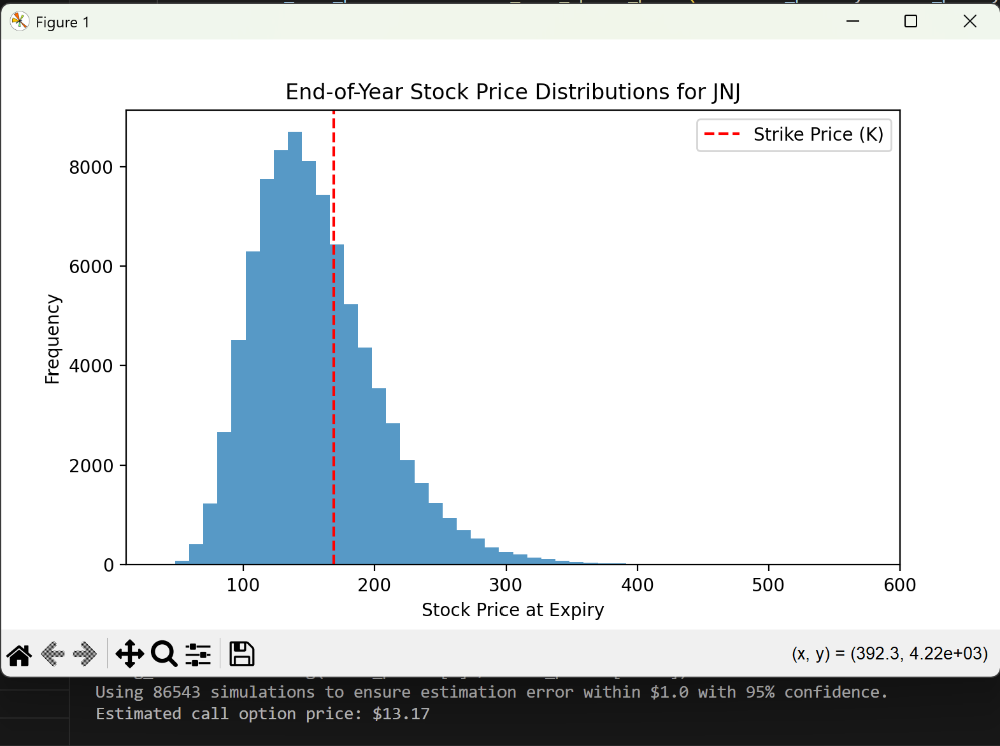

# Monte Carlo Simulation for Option Pricing

This project leverages Monte Carlo simulation to forecast future stock prices using Geometric Brownian Motion (GBM) and calculates the pricing of European call options based on these simulations. The focus is on the stock prices of a selected company over a specific time frame, and the simulation aims to provide insights into the risk and potential returns of stock options.

---

## Contents
- [Project Setup](#project-setup)
  - [Dependencies](#dependencies)
  - [Installation](#installation)
  - [Environmental Variables](#environmental-variables)
- [Mathematical Model](#mathematical-model)
  - [Geometric Brownian Motion (GBM)](#geometric-brownian-motion-gbm)
  - [Monte Carlo Simulation](#monte-carlo-simulation)
  - [Discounting to Present Value](#discounting-to-present-value)
- [Implementation Details](#implementation-details)
  - [Data Acquisition](#data-acquisition)
  - [Simulation Execution](#simulation-execution)
  - [Visualization](#visualization)
- [Evaluation and Results](#evaluation-and-results)
  - [Accuracy and Confidence](#accuracy-and-confidence)

---

## Project Setup

### Dependencies
- Python 3.x
- NumPy
- Matplotlib
- yFinance

### Installation
To install necessary libraries, run:
```bash
pip install numpy matplotlib yfinance
```
## Environmental Variables

To configure the system for matplotlib, set the necessary environment variables:

### For Terminal:
```bash
# Set TCL and TK paths for matplotlib
export TCL_LIBRARY="<path_to_tcl>"
export TK_LIBRARY="<path_to_tk>"
```
### For Python:
```python
import os
os.environ['TCL_LIBRARY'] = "<path_to_tcl>"
os.environ['TK_LIBRARY'] = "<path_to_tk>"
```
## Mathematical Model

### Geometric Brownian Motion (GBM)
The project uses GBM to model the stock prices' dynamics under a stochastic process defined by:

- **Drift (µ)**: Represents the average return of the stock.
- **Volatility (σ)**: Measures the standard deviation of the stock's returns.


The differential equation for GBM is:

$$
dS_t = \mu S_t \, dt + \sigma S_t \, dW_t
$$

where **dW_t** represents the increment of a Wiener process, modeling the random market fluctuations.

---

### Monte Carlo Simulation
Simulations are conducted by repeatedly sampling possible future stock price paths based on the GBM formula. The simulation considers:

- **Initial Stock Price**: Taken from the latest available price data.
- **Annualized Return and Volatility**: Calculated from historical data.
- **Time Horizon and Steps**: Set to one year divided into 252 trading days.

---

### Discounting to Present Value
The concept of discounting to present value is critical in determining the current worth of future cash flows from the option's payoffs at maturity. The formula used is:

$$
PV = \frac{CF}{(1 + r)^T}
$$

where:
- **CF** is the future cash flow (payoff),
- **r** is the risk-free rate,
- **T** is the time to maturity.

This step adjusts the future payoffs to their present value, accounting for the risk-free rate and highlighting the importance of the time value of money.

## Implementation Details

### Data Acquisition
Stock data is fetched using yFinance, focusing on historical closing prices to calculate the necessary parameters for simulation.

### Simulation Execution
The project iterates over numerous simulated paths to average out the randomness and provides an estimate of the option's price.

### Visualization
Results are visualized using histograms to represent the distribution of simulated end-of-year stock prices, and the strike price is marked for reference.

---

## Evaluation and Results

### Accuracy and Confidence
The number of simulations is determined using Hoeffding’s inequality to ensure that the estimated option price falls within a tolerable error range with a confidence level of 95%.



